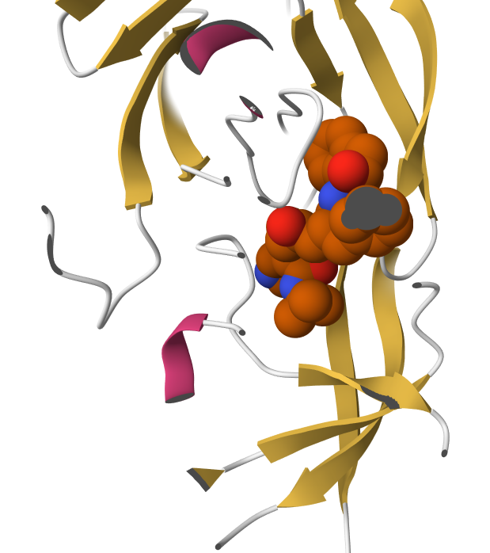
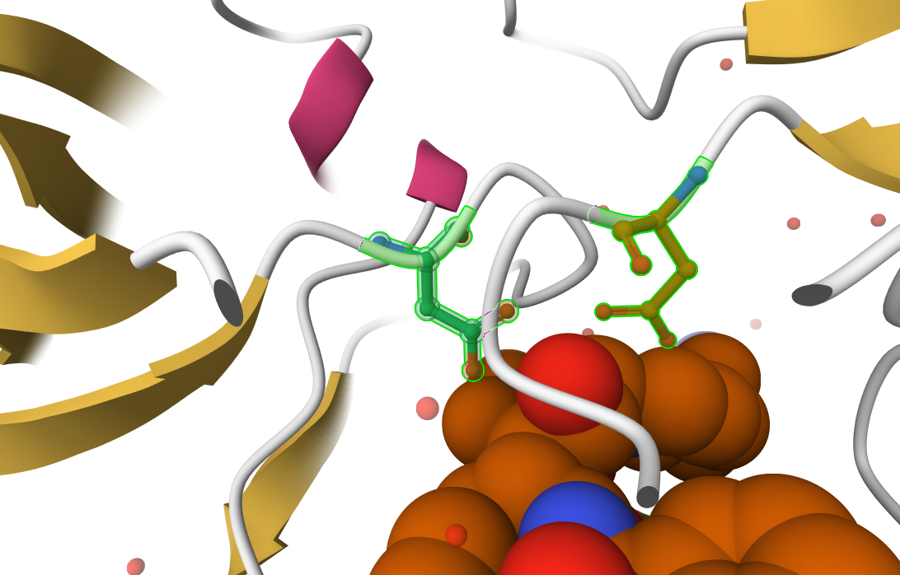
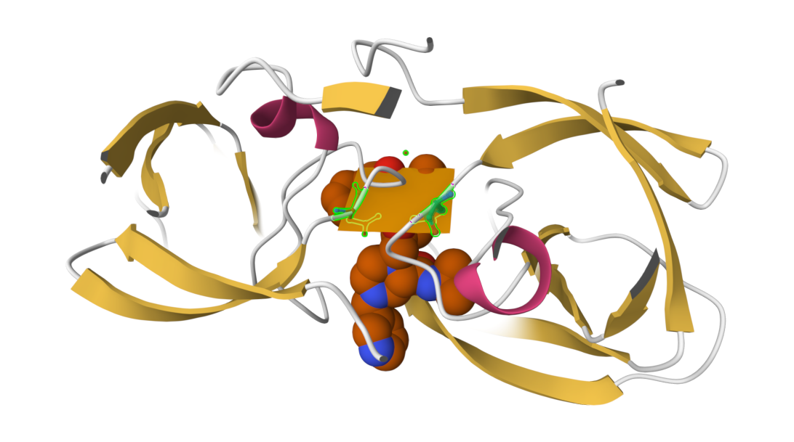

## Background

The main repository of high-resolution structural data on biomolecules is called the **Protein Data Bank** (PDB)

## PDB statistics

What is in the PDB in terms of molecule type and structure determination method?

Read a CSV file of current PDB stats from: https://www.rcsb.org/stats/summary

```{r}
pdb <- read.csv ("Data Export Summary.csv")
pdb
```

```{r}
pdb$X.ray
```

This print out above `pdb$X.ray` is a "character" not "numeric". Therefore I can't do math with it. We need to fix this...

Two functions that can help `sub()` and `as.numeric()`

```{r}
# We want to get rid (or sub out) commas:

x <- pdb$X.ray
tmp <- sub(",","",x)
sum(as.numeric(tmp))
```

We could make a function to do this:

```{r}
rm.comma <- function(x) {
  tmp <- sub(",","",x)
sum(as.numeric(tmp)) }

```

```{r}
rm.comma(pdb$X.ray)
rm.comma(pdb$EM)
```

We could also use a different import function for this CSV that speaks American (i.e. deals with commas in numbers in a comma separated value file).

> Q1: What percentage of structures in the PDB are solved by X-Ray and Electron Microscopy.

So for X-ray, we got 80.5% and for EM, it was 13.4%.

```{r}
library(readr)
pdb <- read_csv("Data Export Summary.csv")
```

```{r}
n.tot <- sum(pdb$Total)
n.xray <- sum(pdb$`X-ray`)
n.em <- sum(pdb$EM)

n.xray / n.tot * 100 
n.em / n.tot * 100

sum(pdb$`Xray`) / n.tot
```

So for X-ray, we got 80.5% and for EM, it was 13.4%. \> **Key-point**: We have a very, very small structural coverage of known proteins (\~0.1%). Most structures we know about (\~80%) come from one method (X-ray Crystalography).

> Q2. What proportion of structures in the PDB are protein?

\~85%of structures in PDB are Protein.

```{r}
n.protein <- sum(pdb$Total[pdb$`Molecular Type` == "Protein (only)"])
n.protein / n.tot *100 
```

> Q3. Type HIV in the PDB website search box on the home page and determine how many HIV-1 protease structures are in the current PDB?

1,147 Structures

## Visualizing the HIV-1 Protease Structure

{width="400px"}

> Q4: Water molecules normally have 3 atoms. Why do we see just one atom per water molecule in this structure?

We only see one atom per water molecule because hydrogen atoms are too small to be detected by X-ray crystallography. Causing for us to only see the only one oxygen atom of each water molecule.

{width="400px"}

> Q5: There is a critical “conserved” water molecule in the binding site. Can you identify this water molecule? What residue number does this water molecule have

HOH 13, is the water molecule that is in the active site as well as interacting with ASP25.

{width="400px"}

> Q6: Generate and save a figure clearly showing the two distinct chains of HIV-protease along with the ligand. You might also consider showing the catalytic residues ASP 25 in each chain and the critical water (we recommend “Ball & Stick” for these side-chains). Add this figure to your Quarto document.

{width="400px"}

> Discussion Topic: Can you think of a way in which indinavir, or even larger ligands and substrates, could enter the binding site?

Larger ligands such as indinavir can enter the binding site because of HIV Protease flexibility. Since the enzyme has flap regions that open toexpose the active site and close when ligand binds. Because the active site lies between the two chains of the homodimer, these structural movents are essential for substrate access.

## Introduction to Bio3D in R

```{r}
library(bio3d)

pdb <- read.pdb("1hsg")
pdb
```

> Q7: How many amino acid residues are there in this pdb object?

198 amino acid residues are in the pdb object

> Q8: Name one of the two non-protein residues?

HOH, or MK1

> Q9: How many protein chains are in this structure?

There are 2 chains.

```{r}
attributes(pdb)
```

```{r}
head(pdb$atom)
```

## Quick PDB visualization in R

```{r}
#| eval: false
library(bio3dview)
library(NGLVieweR)

view.pdb(pdb) |>
  setSpin()
```

```{r}
#| eval: false
# Select the important ASP 25 residue
sele <- atom.select(pdb, resno=25)

# and highlight them in spacefill representation
view.pdb(pdb, cols=c("red","blue"), 
         highlight = sele,
         highlight.style = "spacefill", backgroundColor = "pink") |>
  setRock()
```

## Predicting Functional Motions of a single structure

```{r}
adk <- read.pdb("6s36")
adk
```

```{r}
# Perform flexiblity prediction
m <- nma(adk)
plot(m)
```

```{r}
mktrj(m, file="adk_m7.pdb")
```

```{r}
#| eval: false
view.nma(m, pdb=adk)
```

Write out the results for viewing in Mol - Star

## Comparative Structure Analysis of Adenylate Kinase

> Q10. Which of the packages above is found only on BioConductor and not CRAN?

The only package that is only on Bioconductor is msa.

> Q11. Which of the above packages is not found on BioConductor or CRAN?:

bio3dview is not found on CRAN or BioConductor

> Q12. True or False? Functions from the pak package can be used to install packages from GitHub and BitBucket?

True.

```{r}
library(bio3d)
aa <- get.seq("1ake_A")
```

```{r}
aa
```

> Q13. How many amino acids are in this sequence, i.e. how long is this sequence?

214 amino acids are in this sequence.

```{r}
hits <- NULL
hits$pdb.id <- c('1AKE_A','6S36_A','6RZE_A','3HPR_A','1E4V_A','5EJE_A','1E4Y_A','3X2S_A','6HAP_A','6HAM_A','4K46_A','3GMT_A','4PZL_A')
```

```{r}
files <- get.pdb(hits$pdb.id, path = "pdbs", split = TRUE, gzip = TRUE)
pdbs <- pdbaln(files, fit = TRUE, exefile = "msa")
```

```{r}
#| eval: false
library(bio3dview)
view.pdbs(pdbs)
```

## Annotate Collected PDB structures

```{r}
# Vector containing PDB database codes
ids <- basename.pdb(pdbs$id)

anno <- pdb.annotate(ids)
unique(anno$source)
```

```{r}
anno

```

Search \## Principal Component Analysis

```{r}
# Perform PCA
pc.xray <- pca(pdbs)
plot(pc.xray)
```

```{r}
# Calculate RMSD
rd <- rmsd(pdbs)

# Structure-based clustering
hc.rd <- hclust(dist(rd))
grps.rd <- cutree(hc.rd, k=3)

plot(pc.xray, 1:2, col="grey50", bg=grps.rd, pch=21, cex=1)
```

## PCA Visualization

```{r}
# Visualize first principal component
pc1 <- mktrj(pc.xray, pc=1, file="pc_1.pdb")
```

```{r}
#Plotting results with ggplot2
library(ggplot2)
library(ggrepel)

df <- data.frame(PC1=pc.xray$z[,1], 
                 PC2=pc.xray$z[,2], 
                 col=as.factor(grps.rd),
                 ids=ids)

p <- ggplot(df) + 
  aes(PC1, PC2, col=col, label=ids) +
  geom_point(size=2) +
  geom_text_repel(max.overlaps = 20) +
  theme(legend.position = "none")
p
```

## Normal Mode Analysis

```{r}
modes <- nma(pdbs)
plot(modes, pdbs, col=grps.rd)

```

> Q14. What do you note about this plot? Are the black and colored lines similar or different? Where do you think they differ most and why?

The black and colored lines are mostly similar, but around 120-160 is where the colored lines show high fluctuations. This indicates increased flexibility in these reigions, likely due to conformational changes in functional sites like the binding pocket.
